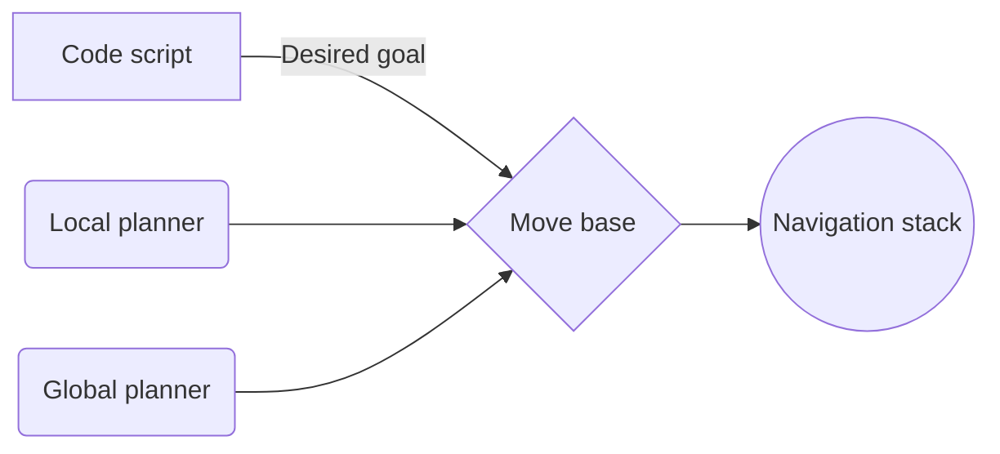

---
layout: post
title: "ROS Simulation of Mobile Robot"
description: "If machines can think and learn these days, how about moving on their own?"
categories: envision
thumbnail: "ros-sim.jpeg"
gmeet: "https://meet.google.com/wjc-tqkh-qva"
---

### Project Mentors

- Shobuj Paul
- Pranshu Shukla

### Project Members

- Jishnu Das
- Shashank H S
- S Rikthika

## Abstract

An intelligent autonomous robot is required in various applications such as space, transportation, industry, and defence. Mobile robots can also perform several tasks like material handling, disaster relief, patrolling, and rescue operation. Therefore, an autonomous robot is required that can travel freely in a static or a dynamic environment. Smooth and safe navigation of mobile robot through cluttered environment from start position to goal position with following safe path and producing optimal path length is the main aim of mobile robot navigation.

## Aim

The aim of this project is to implement the autonomous robot navigation stack in ROS which includes implementation of self-localization and path planning in a known environment to make robot reach desired target in the map.

## Methodology

To achieve the desired aspects of the project, we carefully considered the pros and cons of different frameworks and tools. The following is the description about the flow of the project and the different utilities used, categorized based on their application and purpose:

### Simulation and Testing

For the purpose of implementing this project and simulating the results, we used the **Robot Operating System (ROS)** framework. It is an open-source development platform for robotics comprising a multitude of packages and software for building, writing and testing systems and processes. Keeping in mind the latest developments and package statuses in ROS versions - we opted for ROS Melodic Morenia, compatible with Ubuntu 18.04.

For attaining results which closely resembles the real world, **Gazebo** is used as the 3D simulator. Gazebo comes with ROS to provide frameworks that are able to generate a 3D scenario on the computer with robots, obstacles and many other objects utilizing properties of the physical engine for illumination, gravity, inertia, etc.

We have used python in this project to code all the scripts. **Python** is an interpreted high level general purpose programming language. We chose python as it is easy to use, has a wide range of applications and fast to develop.

### Turtlesim & Differential drive robot

**Turtlesim** is a lightweight simulator for learning ROS. It illustrates what ROS does at the most basic level, to give an idea of what one can do with a real robot or robot simulation later on. It's working is same as a differential drive robot.

A **differential drive robot** is a mobile robot whose movement is based on two separately driven wheels placed on either side of the robot body. It can thus change its direction by varying the relative rate of rotation of its wheels and hence does not require an additional steering motion.

Simulating turtlesim in desired motion was the initial step of the project as it basically resembles differential drive robot which is used in the project. Turtlesim can be simulated through python code or using keyboard. Following images shows the turtlesim moving in a circular path and spiral path.

### LIDAR

LIDAR is an acronym for **Light Detection and Ranging**. It is a method for determining ranges(variable distance) by targeting an object with a laser and measuring the time for the reflected light to return to the receiver. LIDAR data is used to avoid obstacles in the path. By knowing the distance and the direction of the obstacles from the current position robot can move in the appropriate direction to avoid obstacles based on the algorithm set by the user.

The following video shows a robot traversing a path designed with an equation which is known to the user and avoiding obstacles to reach the goal point. This is achieved by reading the laser data and using it to the change the direction of the motion to avoid the obstacles.

<iframe width="956" height="538" src="https://www.youtube.com/embed/l8U7drI6GkY" title="YouTube video player" frameborder="0" allow="accelerometer; autoplay; clipboard-write; encrypted-media; gyroscope; picture-in-picture" allowfullscreen></iframe>

### Mapping  

A map is the representation of the environment where the robot will be operating. To make robot reach the goal set initially, we needed to have the map of the environment ready beforehand.

To create a map of the surroundings from a moving robot, it requires the readings to be “stitched” together from previous locations and keep track of all the measurements and movements of the robot. This technique is implied in **SLAM - Simultaneous Localisation and Mapping**. It estimates the map of the environment and the trajectory of a moving device using a sequence of sensor measurements.

A lot of various SLAM techniques are available such as Gmapping, Hector mapping, Cartographer, Rtab mapping etc. For simplicity and robustness of the project, we opted for **Gmapping**. This package provides laser-based techniques and is compacted as a ROS node called slam_gmapping, using which a 2-D occupancy grid map can be generated.

The image shows an environment in the left side along with it's map on the right side.

To simplify the working of this package, it takes the measurement readings from odometry and laser scan, it tries to localize the bot along with the laser scan matching and then using **Extended Kalman Filter (EKF)** it estimates the output by fusing odometry and laser scan matching values. Along with this, it uses a particle filter for localization.

### Localization

Robot localization is the process of determining where a mobile robot is located with respect to its environment. It is one of the fundamental aspect required by an autonomous robot as the knowledge of the robot’s own location is essential in making decisions about future actions.

**AMCL or Adaptive Monte Carlo Localization** is an algorithm that uses a known map of the environment (generated above using Gmapping), range sensor data  and odometry sensor data to localize the robot. As mentioned above, this algorithm uses a **particle filter** to estimate the next position of the robots. The particles act as a representation of the probabilistic distribution of the likely states for the robot.

By repetitive comparisons from sensor and odometry readings, AMCL recalculates the number of particles required for every iteration depending on where the results are most likely to occur and shifts the distribution more closely to that region.

### Costmaps and Path planners

Cost map is a grid in which every cell gets assigned a value (cost) determining distance to obstacle, where higher value means closer distance. Using this map, the robot plans the path in such a way that it avoids obstacles by creating a trajectory with lowest cost (path planning). There are two costmaps, one for local planner and one for global planner.

The objective of path planning is to compute a continuous path that connects the start point and the goal point, while avoiding collision with known obstacles. There are two types of path planners in the Navigation stack:

#### Global Planner

Global planner plans the path from the start to the end goal. The purpose of global path planner is to plan the shortest path which avoids all the obstacle from the start point to the goal point. There are many available algorithms for global path planning. In this project we have used **A\* (A star)**, which is a grid-based algorithm. It uses the global cost map provided to find the fastest path to the goal point without hitting any obstacle. The following is the image of the global costmap used by the global planner.

#### Local Planner

Local planner is used to avoid obstacles and get the robot back to the global path after avoiding obstacles. The purpose of local planner is to find a suitable local plan at every instance. In this project, we have used **DWA(Dynamic Window Approach)** local planner. The following is the image of the local costmap which is used by the local planner.

It can be seen in the image that the local costmap covers only a small portion of the map around the robot which helps local planner in avoiding obstacles in the close vicinity of robot.

### MoveBase client

The move_base node provides a ROS interface for configuring, running, and interacting with the navigation stack on a robot. The move_base package provides an implementation of an action that, given a goal in the world, will attempt to reach it with a mobile base. The move_base node links together a global and local planner to accomplish its global navigation task which includes obstacle avoidance. A detailed description of this Node and its configuration options is found below.

The following flow chart shows how move base node acts as an interface for communicating with navigation stack.

To communicate with MoveBase node, the **SimpleActionClient** interface is used, which is described below.

#### Actionlib Library

In any large ROS based system, there are cases when user would like to send a request to a node to perform some task, and also receive a reply to the request. This can currently be achieved via ROS services.

In some cases, however, if the service takes a long time to execute, the user might want the ability to cancel the request during execution or get periodic feedback about how the request is progressing. The actionlib package provides tools to create servers that execute long-running goals that can be preempted. It also provides a client interface in order to send requests to the server.

The **ActionClient** and **ActionServer** communicate via a **_ROS Action Protocol_**, which is built on top of ROS messages. The client and server then provide a simple **API**(Application Programming Interface) for users to request goals (on the client side) or to execute goals (on the server side) via function calls and callbacks as shown in the image below.

## Results

The main task of the project was to move the robot to a desired goal passing through given way points. The robot has to achieve that autonomously using the map of the environment and the path planning algorithms provided. The goal was passed to the node using python script.

The following video shows the final result.

<iframe width="956" height="538" src="https://www.youtube.com/embed/G1NhjXe00ko" title="YouTube video player" frameborder="0" allow="accelerometer; autoplay; clipboard-write; encrypted-media; gyroscope; picture-in-picture" allowfullscreen></iframe>

## References

1. [http://wiki.ros.org/ROS/Tutorials](http://wiki.ros.org/ROS/Tutorials)
2. [https://github.com/chandravaran/Embedathon_Final](https://github.com/chandravaran/Embedathon_Final)
3. [https://www.theconstructsim.com/exploring-ros-2-wheeled-robot-part-5/](https://www.theconstructsim.com/exploring-ros-2-wheeled-robot-part-5/)
4. [http://wiki.ros.org/move_base](http://wiki.ros.org/move_base)
5. [http://wiki.ros.org/base_local_planner](http://wiki.ros.org/base_local_planner)
6. [https://hotblackrobotics.github.io/en/blog/2018/01/29/action-client-py/](https://hotblackrobotics.github.io/en/blog/2018/01/29/action-client-py/)
